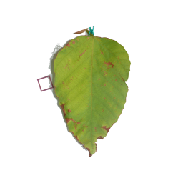
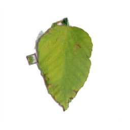

# Automated Quantification of Herbivory

This is just a documented test of the pretrained model from [HerbiEstim](https://github.com/ZihuiWang1/HerbiEstim) using photos of seedling leaves from Ecuador. We would need to perform some preprocessing steps on our dataset before running this more systematically. One example is shown below.

### Raw input image

  

### Image after we ran the processing and splitting step
The background is whiter creating more contrast.

  

### Image with the missing leaf area filled in
Here you can see that the 1 cm square has been interpreted as leaf damage.

  

### Requirements for Usability on Our Dataset

The model performs best on:
- Flat leaves photographed with a neutral or white background
- Uniform lighting without shadows
- A clear scale reference placed outside the leaf area
- No overlapping leaves or complex background textures

### Preprocessing Needed

Before running this model at scale, we will need to:
1. Remove or crop out scale markers (the model currently misinterprets them as herbivory).
2. Standardize background and leaf contrast.
3. Ensure leaves are isolated in each image and consistently oriented.
4. Convert all files to a single image format and resolution.

### Limitations Observed

In preliminary tests, non-leaf objects (e.g., calibration squares) are sometimes classified as missing leaf tissue. This indicates that automated cropping/masking will be required for reliable herbivory estimation.
